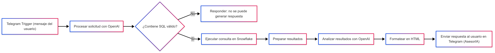

#    Automatizacion Financiera

Se desarrolló un flujo automatizado en N8N utilizando Telegram BotFather, la herramienta oficial de Telegram para la creación de bots. El objetivo principal del robot es permitir a los usuarios consultar información almacenada en la base de datos Snowflake, empleando consultas SQL generadas y validadas de manera automática con apoyo de modelos de lenguaje de OpenAI.

## Flujo del Proceso

El diagrama muestra las etapas principales del proceso de automatización:

Telegram Trigger:
El flujo inicia cuando un usuario envía un mensaje al bot en Telegram. Este mensaje es capturado y transmitido al sistema de N8N.

Recepción de solicitud:
El mensaje recibido se interpreta como un modelo de entrada. Aquí entra en juego OpenAI, que procesa el contenido del mensaje y genera una posible consulta SQL en función de la solicitud realizada por el usuario.

Validación de SQL:

Si el mensaje no contiene una instrucción SQL válida, el sistema responde informando que no es posible generar una respuesta.

Si la instrucción SQL es válida, se continúa con la ejecución de la consulta.

Ejecución en Snowflake:
La consulta SQL generada se envía a Snowflake, que procesa la petición y devuelve los datos correspondientes desde la base de datos corporativa.

Preparación y análisis de resultados:
Los resultados devueltos por Snowflake son organizados y enviados a OpenAI, que realiza un análisis automático de la información obtenida. Este análisis incluye:

Resumen de los datos consultados.

Breve interpretación de los resultados.

Inclusión de la consulta SQL utilizada.

Formato de salida:
La información es transformada a un formato HTML amigable para mejorar la presentación final.

Envío de mensaje a Telegram:
Finalmente, el bot devuelve al usuario un mensaje dentro del chat de Telegram, mostrando el resultado de la consulta junto con un análisis y la consulta SQL que se ejecutó. El bot funciona como un AsesorIA para dar soporte inteligente en la interpretación de datos.

## Beneficios del Proceso

- Automatización completa de la consulta de datos desde Snowflake.

- Acceso inmediato a información empresarial mediante un canal accesible como Telegram.

- Análisis asistido por IA, que no solo muestra datos sino también interpreta resultados.

- Validación automática de consultas SQL, reduciendo errores y mejorando la seguridad.

- Escalabilidad, ya que el flujo puede extenderse a más bases de datos o nuevas funcionalidades del bot.

El robot implementado integra de manera efectiva N8N, Telegram, Snowflake y OpenAI, logrando un flujo robusto para la consulta y análisis de datos en tiempo real. Este sistema no solo proporciona respuestas automáticas, sino que también añade valor al usuario al interpretar la información, consolidando un asesor virtual de inteligencia artificial (AsesorIA) dentro de un entorno de mensajería instantánea.