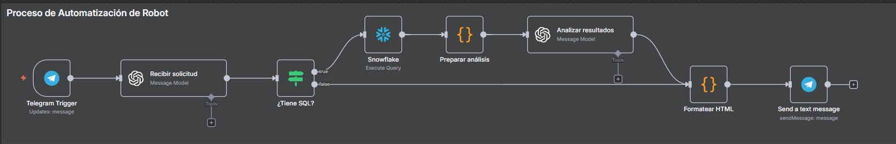
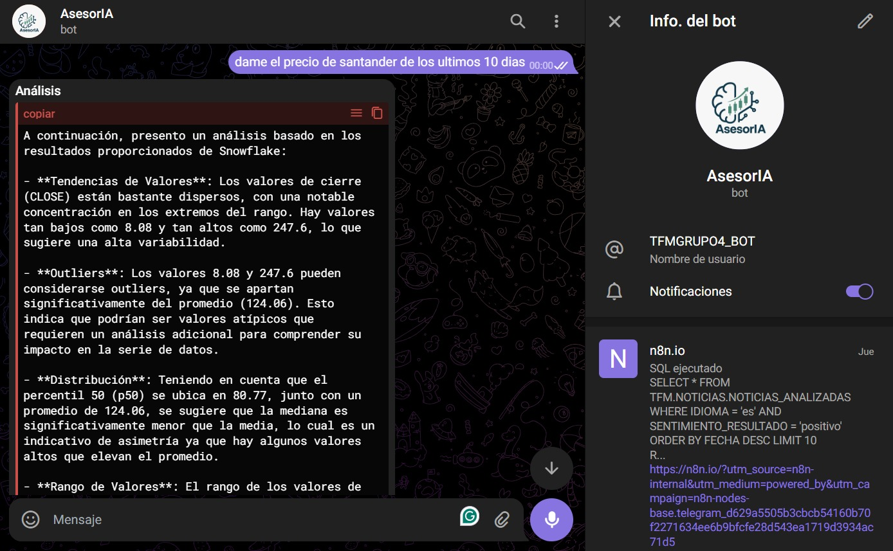

# Implementación de AsesorIA

Se desarrolló un flujo automatizado en N8N utilizando Telegram BotFather, la herramienta oficial de Telegram para la creación de bots. El objetivo principal del robot es permitir a los usuarios consultar información almacenada en la base de datos Snowflake, empleando consultas SQL generadas y validadas de manera automática con apoyo de modelos de lenguaje de OpenAI.

## Flujo del Proceso

El proceso comienza cuando el usuario escribe al bot en Telegram. Ese mensaje llega a N8N, donde OpenAI lo interpreta y, si corresponde, genera una consulta SQL. Si la consulta no es válida, el sistema avisa; si lo es, se ejecuta directamente en Snowflake. Los resultados se organizan y se analizan automáticamente para generar un resumen con la interpretación y la propia consulta utilizada. Finalmente, todo se transforma en un formato claro y se devuelve al usuario en Telegram, de manera que el bot actúa como un asistente inteligente en la interpretación de datos.




## Beneficios del Proceso

- Automatización completa de las consultas en Snowflake.

- Acceso inmediato a la información a través de Telegram.

- Análisis asistido por IA, que interpreta y explica los resultados.

El robot implementado integra de manera efectiva N8N, Telegram, Snowflake y OpenAI, logrando un flujo robusto para la consulta y análisis de datos en tiempo real. Este sistema no solo proporciona respuestas automáticas, sino que también añade valor al usuario al interpretar la información, consolidando un asesor virtual de inteligencia artificial (AsesorIA) dentro de un entorno de mensajería instantánea.



[Datos del Robot Financiero](https://t.me/TFMGRUPO4_BOT)

## Visualización

Iniciamos un recorrido por un panel de informacion financiera donde te tendremos la vision global de los mercados bursátiles europeos, combinando indicadores geográficos, sectoriales y financieros.

- **Mapa geográfico**: Muestra la distribución de los mercados por país, resaltando las plazas bursátiles más relevantes de Europa.  
- **Recuento por Exchange**: Representa el número de compañías cotizadas en cada bolsa (LSE, GER, MIL, PAR, MCE, STO, AMS, EBS), evidenciando el peso de cada mercado en términos de participación empresarial.  
- **Capitalización por país**: Indica la magnitud del *Market Cap* acumulado, donde destacan Reino Unido y Suecia como los países con mayor volumen.  
- **Empleados vs. Market Cap**: Gráfico de dispersión que relaciona la cantidad de empleados con la capitalización de mercado, permitiendo identificar empresas de gran tamaño y alto valor en los distintos sectores.  

En conjunto, esta visión proporciona un panorama comparativo entre países y mercados europeos, destacando tanto la relevancia geográfica como la magnitud económica de las empresas que los componen.


[Dashboard de Análisis Financiero en Tableau](https://public.tableau.com/app/profile/julia.escudero.velasco/viz/TFM_17581412187180/Indice)

```{figure} ../../Imagenes/visionmercados.jpeg
:alt: Visualización del Mercado
:align: center
**Figura 16.** Visualización de los graficos del mercado 
```

Luego podemos ver un análisis por cada una de las empresas que el cliente quiera verificar

- **Boxplots de precios de cierre (2020–2025)**: muestran la dispersión, volatilidad y tendencias anuales de los precios de la acción.  
- **Evolución histórica del precio**: refleja la trayectoria del valor en bolsa con tendencia creciente a pesar de episodios de volatilidad.  

El tablero permite analizar tanto la solidez financiera como el comportamiento bursátil de la empresa, integrando métricas clave y evolución histórica para apoyar la toma de decisiones de inversión.

```{figure} ../../Imagenes/analisisempresarial.jpeg
:alt: análisis Empresarial
:align: center
**Figura 17.** Análisis empresarial en gráficos
```
Seguidamente tendremos el análisis por tickers. Este panel permite analizar y comparar el desempeño de distintas acciones a través de indicadores clave, relacionando riesgo, retorno y evolución temporal.

- **Riesgo vs. Retorno**: gráfico de dispersión que muestra el balance entre la volatilidad y el retorno medio de cada acción.  
  - Las burbujas representan a cada *ticker*, diferenciados por tamaño y color.  
  - Permite identificar qué empresas logran mejores retornos ajustados al riesgo.  

- **Rendimiento acumulado**: evolución temporal del rendimiento compuesto de cada acción, agrupado por trimestre (2020T3–2025T3).  
  - Refleja la dinámica de cada activo y su capacidad de mantener tendencia positiva o negativa en el tiempo.  

- **KPIs de Tickers**
La tabla inferior presenta indicadores clave de desempeño (*Key Performance Indicators*) para cada acción:
- **Precios promedio**: apertura, cierre, máximo y mínimo.  
- **Volatilidad intradía**: medida de la variación dentro de una misma sesión.  
- **Volumen**: cantidad total negociada en el periodo.  
- **Varianza y desviación estándar**: métricas estadísticas que ayudan a dimensionar la dispersión de los precios.  

En resumen, este tablero ofrece una perspectiva integral de varios activos, facilitando la comparación de su riesgo, rentabilidad y evolución histórica, lo que lo convierte en una herramienta útil para la toma de decisiones financieras.

```{figure} ../../Imagenes/exploraciontickers.jpeg
:alt: Exploración Tickers
:align: center
**Figura 18.** Exploración Tickers
```

Por último, este panel ofrece una visión global del sentimiento de las noticias financieras. Resume la proporción de titulares positivos, negativos y neutros, muestra ejemplos representativos y refleja qué medios aportan más información.

```{figure} ../../Imagenes/analisisnoticias.jpeg
:alt: análisis de sentimiento
:align: center
**Figura 19.** análisis de sentimiento por titular de noticieros
```

