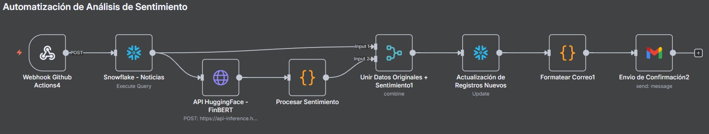
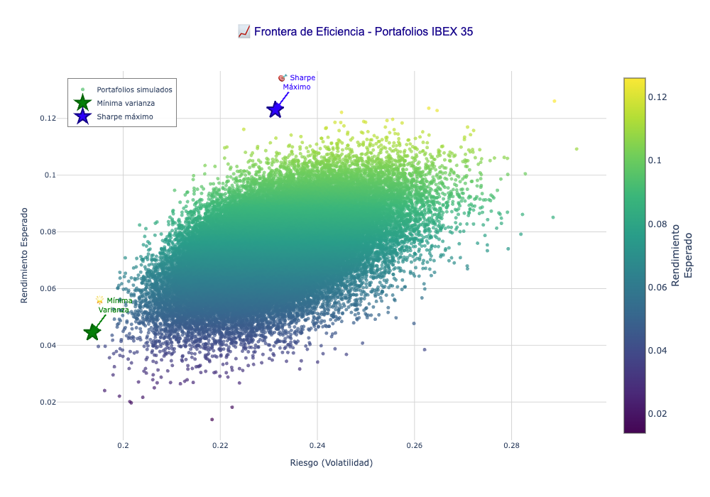

# Modelos Predictivos

## Modelos de análisis de sentimiento 

Se ha decidido utilizar dos modelos predictivo en el cual los dos se utilozaron para predecir la probabilidad de que un titular sea *negativo, positivo o neutral*. los dos modelos son `bert-base-multilingual-uncased-sentiment`[multilingual] y `distilroberta-finetuned-financial-news-sentiment-analysis` [inglés]. Estos dos modelos fueron seleccionados por su rendimiento en clasificación de sentimientos y por su cobertura en distintos idiomas. Dado que las fuentes analizadas incluyen tanto medios en inglés como en español, se ha considerado necesario emplear modelos específicos para cada idioma con el fin de maximizar la precisión de los resultados.  

### Modelo en inglés: *mrm8488/distilroberta-finetuned-financial-news-sentiment-analysis*  

Este modelo corresponde a una versión ajustada de **DistilRoBERTa-base**, entrenada específicamente en el conjunto de datos *Financial PhraseBank*, que contiene 4.840 frases procedentes de noticias financieras en inglés. Dicho corpus fue anotado por entre 5 y 8 expertos, categorizando cada enunciado según su polaridad de sentimiento (positivo, negativo o neutral).  

A nivel arquitectónico, DistilRoBERTa es una versión comprimida de RoBERTa-base que conserva su rendimiento con menor complejidad computacional. Consta de **6 capas, 768 dimensiones y 12 cabezales de atención**, sumando un total aproximado de **82 millones de parámetros** (frente a los 125 millones de RoBERTa-base). Esta reducción permite que el modelo sea, en promedio, **el doble de rápido** en comparación con RoBERTa-base, manteniendo un desempeño competitivo.  

En cuanto a resultados, el modelo alcanzó un **accuracy del 98,23 %** y una pérdida de validación de **0,1116** en el conjunto de evaluación, lo que demuestra un desempeño sobresaliente en la clasificación de sentimiento en el ámbito financiero.  

La principal ventaja de este modelo es su **alta especialización en finanzas**, lo que le permite detectar matices en titulares y frases económicas con gran precisión. No obstante, presenta la limitación de estar restringido exclusivamente al inglés.  

https://huggingface.co/mrm8488/distilroberta-finetuned-financial-news-sentiment-analysis 

### Modelo en español (multilingüe): *nlptown/bert-base-multilingual-uncased-sentiment*

Este modelo se basa en **BERT multilingüe uncased** y ha sido afinado para realizar análisis de sentimiento en reseñas de productos en seis idiomas: inglés, neerlandés, alemán, francés, español e italiano. La principal característica de este modelo es que clasifica el sentimiento en una escala de **1 a 5 estrellas**, en lugar de limitarse a categorías binarias (positivo/negativo) o ternarias (positivo/neutral/negativo). Esto le otorga mayor capacidad para capturar matices y gradaciones en la opinión expresada en los textos.  

A nivel técnico, el modelo cuenta con aproximadamente **167 millones de parámetros** y conserva la arquitectura original de BERT multilingüe uncased, lo que significa que no diferencia entre mayúsculas y minúsculas durante el procesamiento. Fue entrenado sobre un corpus de más de **600 000 reseñas multilingües**, de las cuales **50 000 corresponden al español**, garantizando un desempeño razonable en este idioma.  

En cuanto a métricas, el modelo presenta un rendimiento en español de alrededor de **58 % de exactitud en la predicción exacta** del número de estrellas, y una precisión de **95 % cuando se permite un margen de ±1 estrella**. Este último dato refleja que, aunque puede fallar en la predicción exacta de la escala, en la gran mayoría de los casos logra capturar correctamente la orientación del sentimiento (positivo, negativo o intermedio).  

La **ventaja principal** de este modelo es su **cobertura multilingüe**, lo que permite procesar textos en diferentes idiomas sin necesidad de entrenar modelos independientes para cada caso. Además, la clasificación en una escala de cinco puntos ofrece un análisis más granular y rico en matices, especialmente útil para contextos con opiniones diversas o polarización moderada.  

Sin embargo, el modelo también presenta **limitaciones importantes**. En primer lugar, no fue diseñado ni ajustado específicamente para el **dominio financiero**, lo que puede reducir su capacidad de interpretar correctamente frases técnicas o jergas económicas. En segundo lugar, la precisión exacta en español se sitúa por debajo de otros idiomas como el inglés o el alemán, aunque esta limitación se mitiga al considerar la métrica *off-by-1*.  

En el contexto de este trabajo, el modelo ha sido utilizado principalmente como una herramienta complementaria para el análisis de textos en español. Si bien su desempeño no alcanza la especialización del modelo en inglés, su flexibilidad multilingüe y su buena capacidad de aproximación al sentimiento general lo convierten en una opción adecuada para garantizar cobertura en medios hispanohablantes.

https://huggingface.co/nlptown/bert-base-multilingual-uncased-sentiment

### Comparación y justificación de uso  
La principal diferencia entre ambos modelos radica en su **especialización**. El modelo en inglés ofrece un mejor desempeño en el contexto financiero gracias a su ajuste en noticias económicas, mientras que el modelo en español, aunque más generalista, permite cubrir de manera efectiva los textos en este idioma. En conjunto, la combinación de ambos modelos garantiza un análisis más robusto y equilibrado de noticias financieras procedentes de distintas fuentes y en diferentes idiomas.  

---

### Tabla comparativa de modelos  

| Modelo                                                        | Idioma(s)       | Ventajas                                                                 | Limitaciones                                              |
|---------------------------------------------------------------|-----------------|-------------------------------------------------------------------------|-----------------------------------------------------------|
| *mrm8488/distilroberta-finetuned-financial-news-sentiment-analysis* | Inglés          | Especializado en noticias financieras, mayor precisión en este dominio. | Solo aplica a textos en inglés.                           |
| *nlptown/bert-base-multilingual-uncased-sentiment*            | Multilingüe (incluye español) | Cobertura en más de 100 idiomas, adecuado para análisis en español.     | No especializado en finanzas, menor precisión contextual. |

---

### Automatización del flujo de trabajo con n8n

En la automatización de la ingesta y el procesamiento de datos se ha empleado **n8n**, una herramienta de *workflow automation* de código abierto. Su función principal es permitir la integración entre múltiples servicios, APIs y bases de datos mediante la creación de flujos de trabajo visuales que se ejecutan de manera automática en función de determinados eventos o programaciones. A partir del trigger que en nuestro caso de de tiempo (00:00 todos los dias), los nodos se van ejecutando en orden lógico, permitiendo que la información fluya automáticamente entre servicios sin intervención manual.

En conjunto, n8n se convierte en un componente clave para la **orquestación de datos** en este proyecto, permitiendo que el análisis de sentimiento y financiero se sustente en información 


---
### Flujo de utilizacion de los modelos

Dentro del *datalake* definido en el módulo de **Datos y Preparación**, se encuentra la tabla unificada denominada `TODOS_TITULARES`. A partir de esta base de datos se extraen los titulares procedentes de los distintos noticieros. Posteriormente, mediante un **árbol de decisión** se determina el idioma de cada titular (inglés o español). Según el resultado, se aplica el modelo de predicción correspondiente, previamente entrenado para el análisis de sentimiento en cada idioma.

---
### Generacion de las columnas con tipo de titulos 

Una vez aplicados los modelos de análisis de sentimiento, se generan cuatro variables principales: `SENTIMIENTO_RESULTADO`, `PROBABILIDAD_POSITIVO`, `PROBABILIDAD_NEGATIVA` y `PROBABILIDAD_NEUTRAL`. Estas variables permiten determinar de manera objetiva la clasificación final del texto en función de su polaridad. Posteriormente, los resultados se incorporan a la tabla principal de **Noticias_Analizadas** y se almacenan nuevamente en Snowflake, lo que garantiza su disponibilidad para futuros análisis, tanto de carácter técnico como de integración con otros indicadores financieros.

| FECHA      | TITULAR                                                                 | FUENTE | SENTIMIENTO_RESULTADO | PROBABILIDAD_POSITIVO | PROBABILIDAD_NEUTRAL | PROBABILIDAD_POSITIVO |
|------------|-------------------------------------------------------------------------|--------|-----------------------|-----------------------|----------------------|-----------------------|
| 2024-02-27 | Felipe VI pide que los avances tecnológicos protejan la seguridad y los derechos individuales | ABC    | Neutral               | 0.73806867            | 0.1435076594         | 0.73806867            |
| 2024-01-16 | El Gobierno delega en las autonomías la ampliación del bono joven de alquiler | ABC    | Neutral               | 0.7266298234          | 0.1628957987         | 0.7266298234          |
| 2024-01-30 | Reynés (Naturgy) elogia a BlackRock por dar estabilidad a las empresas y ve «alineamiento de intereses» | ABC    | Neutral               | 0.4201913178          | 0.3785941601         | 0.4201913178          |

---

## Analisis de Frontera de eficiencia

Para la selección de nuestra cartera emplearemos el modelo de media-varianza de Markowitz, considerado la base de la Teoría Moderna de Carteras. Este enfoque es ampliamente utilizado en finanzas porque permite encontrar la combinación óptima de activos equilibrando riesgo y rendimiento esperado.
El procedimiento consiste en simular 50.000 carteras aleatorias con diferentes ponderaciones de activos. Posteriormente, se identifican aquellas que cumplen con dos criterios clave:
- Cartera de mínima varianza: la que presenta el menor nivel de riesgo posible.
- Cartera con ratio de Sharpe máximo: la que ofrece la mejor relación entre rendimiento y riesgo ajustado por la tasa libre de riesgo.

    Ver teoría en {ref}`modelo-de-markowitz`

El primer aspecto a considerar es que los resultados de nuestro modelo se generan siempre con datos actualizados hasta el día anterior en todas las bases de datos. Dichos resultados se almacenan en un datalake implementado en Snowflake, el cual se encuentra en constante actualización. Por ello, la primera fase de nuestro análisis consiste en establecer la conexión con Snowflake y asegurar la correcta creación, configuración y mantenimiento del datalake.

Una vez completada esta etapa, el modelo se vincula con las acciones seleccionadas por el usuario en función de su análisis fundamental —[AQUÍ INCLUIR EL NOMBRE DE LA SECCIÓN DE ANÁLISIS FUNDAMENTAL]—. Para cada activo elegido, se verifican las tendencias históricas y se realizan diferentes simulaciones con variaciones en los porcentajes de asignación.

De este modo, el modelo permite seleccionar la combinación más eficiente considerando no solo los criterios de diversificación cuantitativa, sino también el análisis fundamental, el análisis descriptivo de los datos históricos y el análisis de sentimiento obtenido a partir de noticias sectoriales e industriales.


El cálculo de los rendimientos de los activos es una etapa fundamental previa a cualquier análisis de carteras. A partir de los precios históricos, se obtienen las variaciones porcentuales que reflejan cómo evoluciona el valor de cada activo en el tiempo.

```{literalinclude} ../../Analisis_ML/Frontera_Eficiencia.py
:language: python
:linenos:
:start-after: --8<-- [start:rendimientos]
:end-before: --8<-- [end:rendimientos]
```

Una vez obtenidos los datos necesarios para el análisis principal, procedemos a la simulación de 50.000 portafolios aleatorios. Este proceso nos permite explorar un amplio rango de combinaciones posibles entre los activos y, de este modo, identificar aquellas carteras que ofrecen el mejor equilibrio entre riesgo y rendimiento esperado.

```{literalinclude} ../../Analisis_ML/Frontera_Eficiencia.py
:language: python
:linenos:
:start-after: --8<-- [start:iteracioncarteras]
:end-before: --8<-- [end:iteracioncarteras]
```

Con este procedimiento se han generado 50.000 carteras simuladas, cada una con su respectivo nivel de riesgo y rendimiento esperado. A partir de estos resultados, y considerando una tasa libre de riesgo del 3%, se calcula el ratio de Sharpe, lo que nos permite identificar la combinación de acciones más eficiente en términos de la relación rentabilidad–riesgo. La siguiente tabla muestra algunos ejemplos representativos de estas carteras:

| Rendimientos | Riesgos  | PesoACS.MC | PesoAENA.MC | PesoBBVA.MC | PesoCABK.MC | PesoELE.MC | PesoENG.MC | PesoFER.MC | PesoIAG.MC | PesoIBE.MC | PesoITX.MC | PesoMAP.MC | PesoREP.MC | PesoSAN.MC | PesoTEF.MC |
|--------------|----------|------------|-------------|-------------|-------------|------------|------------|------------|------------|------------|------------|------------|------------|------------|------------|
| 0.094535     | 0.236939 | 0.056633   | 0.050586    | 0.146062    | 0.077725    | 0.046691   | 0.035503   | 0.113892   | 0.069035   | 0.062491   | 0.131826   | 0.036659   | 0.013266   | 0.052721   | 0.106909   |
| 0.088686     | 0.247779 | 0.150650   | 0.047172    | 0.018697    | 0.065942    | 0.009546   | 0.004347   | 0.037379   | 0.134567   | 0.145345   | 0.096339   | 0.017419   | 0.038019   | 0.119666   | 0.114913   |    
| 0.076873     | 0.232206 | 0.130143   | 0.112952    | 0.103699    | 0.046427    | 0.117658   | 0.066646   | 0.027429   | 0.084714   | 0.030029   | 0.094975   | 0.118723   | 0.011767   | 0.007015   | 0.047825   |


```{literalinclude} ../../Analisis_ML/Frontera_Eficiencia.py
:language: python
:linenos:
:start-after: --8<-- [start:varianza_minima]
:end-before: --8<-- [end:varianza_minima]
```

### Gráfica de la frontera de eficiencia

Este gráfico es un ejemplo con una cartera del IBEX35 el cual representa la frontera eficiente obtenida a partir de la simulación de 50.000 combinaciones de activos. En ek eje horizontal tenemos el riesgo del portafolio medido como volatilidad y en el eje vertical tenemos el rendimiento esperado por el portafolio. La nuve de puntos son los portafolios creados aleatoriamente que combina cada uno de los pesos de las acciones de cada portafolio.

La estrella verde, abajo a la izquierda, es la cartera con el menor riesgo posible, aunque su rentabilidad es moderada y la estrella azul, arriba a la derecha es la cartera más eficiente en términos de relación riesgo–rentabilidad, considerando la tasa libre de riesgo.

