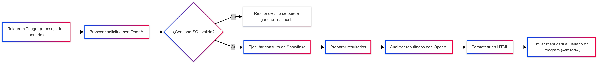

#    Automatizacion Financiera

Se desarrolló un flujo automatizado en N8N utilizando Telegram BotFather, la herramienta oficial de Telegram para la creación de bots. El objetivo principal del robot es permitir a los usuarios consultar información almacenada en la base de datos Snowflake, empleando consultas SQL generadas y validadas de manera automática con apoyo de modelos de lenguaje de OpenAI.

## Flujo del Proceso

El proceso comienza cuando el usuario escribe al bot en Telegram. Ese mensaje llega a N8N, donde OpenAI lo interpreta y, si corresponde, genera una consulta SQL. Si la consulta no es válida, el sistema avisa; si lo es, se ejecuta directamente en Snowflake. Los resultados se organizan y se analizan automáticamente para generar un resumen con la interpretación y la propia consulta utilizada. Finalmente, todo se transforma en un formato claro y se devuelve al usuario en Telegram, de manera que el bot actúa como un asistente inteligente en la interpretación de datos.

## Beneficios del Proceso

- Automatización completa de las consultas en Snowflake.

- Acceso inmediato a la información a través de Telegram.

- Análisis asistido por IA, que interpreta y explica los resultados.

El robot implementado integra de manera efectiva N8N, Telegram, Snowflake y OpenAI, logrando un flujo robusto para la consulta y análisis de datos en tiempo real. Este sistema no solo proporciona respuestas automáticas, sino que también añade valor al usuario al interpretar la información, consolidando un asesor virtual de inteligencia artificial (AsesorIA) dentro de un entorno de mensajería instantánea.

[Datos del Robot Financiero](https://t.me/TFMGRUPO4_BOT)